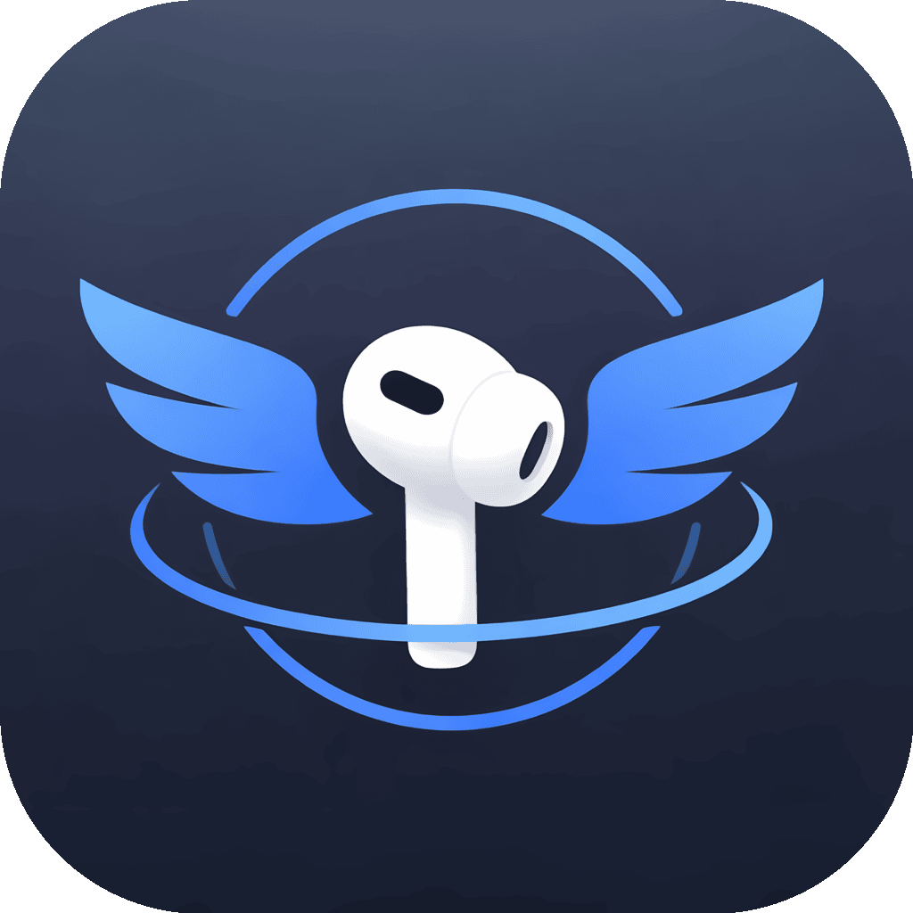

<p align="center">
  
</p>

<h1 align="center">HeadBird</h1>

<p align="center">
  HeadBird is a native macOS menu bar app that reads AirPods head-tracking motion and visualizes Roll, Pitch, and Yaw in real time.
</p>

<p align="center">
  
  
  
  
  
  
  
  
  
  
  
  
</p>

## Features

- Real-time Roll, Pitch, and Yaw visualization.
- Motion history graph for quick trend reading.
- One-click zero calibration.
- Head-controlled mini game (tilt your head up/down to play).
- Lightweight macOS menu bar UX.

## Install From Released DMG (Future Releases)

When a release is published on GitHub:

1. Open the latest release and download `HeadBird-<version>-macos-*.dmg`.
2. Double-click the `.dmg` file.
3. Drag `HeadBird.app` into `Applications`.
4. Launch `HeadBird` from `Applications` or Spotlight.

## If macOS Shows "Malware" / Unverified Developer Warning

Because early releases may be distributed without Apple notarization, macOS Gatekeeper can block first launch.

Use one of these methods:

1. Finder method:
   - Open `Applications`.
   - Right-click `HeadBird.app` and click `Open`.
   - Click `Open` again in the security prompt.
2. System Settings method:
   - Try opening the app once.
   - Go to `System Settings -> Privacy & Security`.
   - In the Security section, click `Open Anyway` for HeadBird.
3. Terminal fallback (advanced users):

```bash
xattr -dr com.apple.quarantine "/Applications/HeadBird.app"
```

Notes:

- Only remove quarantine for apps you trust.
- If checksum is provided in the release notes, verify it before first launch.

## First-Launch Permissions

HeadBird requests:

- Bluetooth permission (to detect AirPods connection state).
- Motion permission (to read AirPods head-tracking data).

If previously denied, re-enable in `System Settings -> Privacy & Security`.

## Build From Source (Xcode)

Requirements:

- macOS 14+
- Xcode 15+
- AirPods connected to your Mac

Run:

1. Open `HeadBird.xcodeproj`.
2. Select scheme `HeadBird` and destination `My Mac`.
3. Press `Cmd + R`.
4. Click the menu bar icon to open the app UI.

## Running Tests Locally

Run the local test script:

```bash
./scripts/run-tests.sh
```

Or run `xcodebuild` directly:

```bash
xcodebuild test \
  -project HeadBird.xcodeproj \
  -scheme HeadBird \
  -destination 'platform=macOS,arch=arm64' \
  CODE_SIGNING_ALLOWED=NO
```

## Manual DMG Release Workflow (Maintainers)

This project currently uses a manual release flow in Xcode.

1. Build `Release` in Xcode.
2. In Xcode, open `Product -> Show Build Folder in Finder`.
3. Locate `HeadBird.app` under `Build/Products/Release`.
4. Stage DMG contents:

```bash
APP="/ABSOLUTE/PATH/TO/HeadBird.app"
VERSION="0.1.0"
STAGE="/tmp/HeadBird-dmg-stage"
RW_DMG="/tmp/HeadBird-${VERSION}-rw.dmg"
FINAL_DMG="$HOME/Desktop/HeadBird-${VERSION}-macos-arm64.dmg"

rm -rf "$STAGE" "$RW_DMG" "$FINAL_DMG"
mkdir -p "$STAGE/.background"
cp -R "$APP" "$STAGE/HeadBird.app"
ln -s /Applications "$STAGE/Applications"
```

5. Create and mount a read-write DMG:

```bash
hdiutil create -volname "HeadBird" -srcfolder "$STAGE" -ov -format UDRW "$RW_DMG"
hdiutil attach "$RW_DMG"
```

6. In Finder, arrange the mounted volume for drag-to-Applications UX:
   - View as Icons.
   - Set icon size and grid spacing in Show View Options.
   - Place `HeadBird.app` on the left and `Applications` alias on the right.
   - Close the Finder window and eject the mounted volume.

7. Convert to compressed release DMG:

```bash
hdiutil convert "$RW_DMG" -format UDZO -imagekey zlib-level=9 -o "$FINAL_DMG"
shasum -a 256 "$FINAL_DMG"
```

8. Upload `FINAL_DMG` to GitHub Releases (mark as Pre-release if needed).

## Versioning

HeadBird follows Semantic Versioning.

- Current planned public baseline: `v0.1.0`.
- `MARKETING_VERSION` should remain `0.1.0` in Xcode for this release line.

## Privacy

- No microphone recording.
- No audio content processing.
- Uses local device state and motion signals only for app features.
